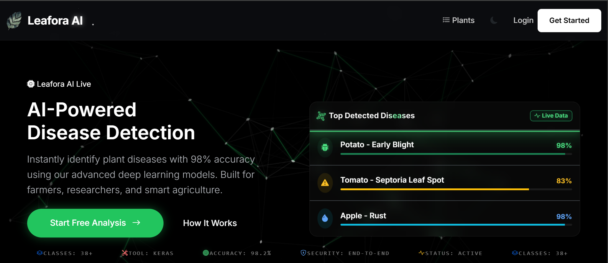

## Lefora AI – Deep Learning Crop Disease Detection System

<!-- 📸 Project screenshot: save the image as docs/hero.png -->
<p align="center">
  
</p>

Lefora AI is a **production-ready Flask web application** that uses **deep learning** to detect crop leaf diseases from images.  
It helps farmers, agronomists, and researchers quickly identify plant health issues and get **clear, actionable recommendations** to protect yield and reduce crop loss.

---

## Key Features

- **AI-powered disease detection**: Upload a leaf image and get model predictions with confidence scores.
- **Detailed disease profiles**: Shows crop name, likely disease, pathogen type, risk level, symptoms, and suggested actions.
- **History & analytics**: Stores past predictions so users can review previous scans and monitor trends over time.
- **User management**: Flask authentication with secure password hashing and session management.
- **Admin dashboard**: Administrative views for monitoring predictions, system logs, and visual settings.
- **Configurable UI/UX**: Advanced visual options for cursor animations and page background animations.
- **SQLite/SQLAlchemy backend**: Reliable relational storage with migration support via Flask-Migrate.

---

## Tech Stack

- **Backend**: Python, Flask, Flask-SQLAlchemy, Flask-Migrate
- **ML / DL**: Keras with TensorFlow backend (loaded via `predict.py`)
- **Database**: SQLite by default (can be switched via `SQLALCHEMY_DATABASE_URI`)
- **Auth & Security**: Werkzeug password hashing, Flask session management
- **Other**: Jinja2 templates, JSON-based disease knowledge base (`disease_info.json`)

---

## Project Structure (High Level)

- `app.py` – Main Flask application, routes, database models, and core logic.
- `predict.py` – Model loading and disease prediction utilities (must be present in the project root).
- `config.py` – `Config` class with Flask and SQLAlchemy configuration.
- `disease_info.json` – Disease metadata and recommendation text used to enrich model outputs.
- `templates/` – Jinja2 HTML templates for pages (dashboard, upload, results, admin, etc.).
- `static/` – Static assets (CSS, JS, images, animations).

> Note: Some of these files/folders are inferred from the app and may use slightly different names in your actual project.

---

## Getting Started

### 1. Clone the Repository

```bash
git clone https://github.com/sherlock-dev-ai/<your-repo-name>.git
cd <your-repo-name>
```

### 2. Create and Activate a Virtual Environment (Recommended)

```bash
python -m venv venv
venv\Scripts\activate  # Windows
# source venv/bin/activate  # Linux / macOS
```

### 3. Install Dependencies

```bash
pip install -r requirements.txt
```

### 4. Model Setup (Hugging Face)

This project uses Hugging Face to host large model files (>100MB). 

1. **Login to Hugging Face CLI**:
   ```bash
   huggingface-cli login
   ```
   (Enter your Hugging Face Access Token when prompted)

2. **Download Models** (Optional - they will auto-download on first use):
   ```bash
   python download_model.py
   ```

### 5. Configure Environment

- Ensure `config.py` contains a `Config` class with:
  - `SECRET_KEY`
  - `SQLALCHEMY_DATABASE_URI` (e.g., `sqlite:///leafora.db`)
  - Any other relevant Flask or SQLAlchemy settings.
- Place your trained model and related files where `predict.py` expects them.
- Ensure `disease_info.json` exists in the project root (or adjust the path in `app.py` if needed).

### 5. Initialize the Database

If you are using Flask-Migrate:

```bash
flask db init
flask db migrate -m "Initial migration"
flask db upgrade
```

Or create the database tables directly via your app’s setup utilities if provided.

### 6. Run the Application

```bash
set FLASK_APP=app.py        # Windows PowerShell: $env:FLASK_APP = "app.py"
set FLASK_ENV=development   # Optional for debug mode
flask run
```

By default, the app will be available at `http://127.0.0.1:5000/`.

---

## Usage

1. **Open the app in your browser** after starting the Flask server.
2. **Sign up / log in** if authentication is enabled.
3. Go to the **Upload** page and **upload a leaf image** (preferably clear, single-leaf focus).
4. View the **prediction results**:
   - Top disease classes with confidence scores.
   - Disease profile: crop, pathogen type, risk level, symptoms, and recommended actions.
5. Visit the **History** or **Dashboard** sections to review previous scans and analytics.
6. Admin users can access **admin dashboards** for system logs, prediction management, and visual UI settings.

---

## Admin Access

- **Admin login URL**: Visit the regular login page, then navigate to the admin dashboard at `/admin` after logging in as admin.  
- **Default admin credentials** (created automatically if missing):
  - **Email**: `admin@admin.com`
  - **Password**: `admin123`

> **Important**: For any public or production deployment, log in immediately and **change the admin email and password** to strong, unique values.

---

## Configuration & Customization

- **Disease metadata**: Edit `disease_info.json` to refine disease descriptions, control measures, and recommendations.
- **Visual settings**: `admin_visual_settings.json` (created at runtime) stores cursor and page animation preferences.
- **Database**: Switch from SQLite to another RDBMS (e.g., PostgreSQL/MySQL) by updating `SQLALCHEMY_DATABASE_URI`.
- **Logging**: Application errors are logged to `app_errors.log` and also streamed to the console.

---

## Deployment

For production:

- Use a production-ready WSGI server (e.g., **gunicorn**, **uWSGI**) behind **Nginx** or another reverse proxy.
- Set `FLASK_ENV=production` and a strong `SECRET_KEY`.
- Point `SQLALCHEMY_DATABASE_URI` to a production-grade database.
- Configure proper logging, HTTPS, and environment variables.

---

## Limitations & Disclaimer

- Model predictions are **probabilistic** and may be affected by image quality, lighting, and unseen disease types.
- This tool is intended as a **decision-support system**, not a replacement for professional agronomic diagnosis.
- Always validate critical decisions with local experts, especially for large-scale crop management.

---

## Contributing

Contributions are welcome!  
You can:

- Report bugs or issues via GitHub Issues.
- Open pull requests for bug fixes, new features, or documentation improvements.
- Suggest enhancements to the model or disease knowledge base.

---

## License

Specify your license here (for example):

- **MIT License** – see `LICENSE` for details.

If you haven’t chosen a license yet, consider adding one before making the repo public.

---

## Author & Acknowledgements

- **Author**: (Add your name / team name here)
- **Project**: Lefora AI – Deep Learning Crop Disease Detection System

Special thanks to:

- The open-source deep learning ecosystem (TensorFlow, Keras, Flask, SQLAlchemy, etc.).
- Researchers and datasets that enabled training crop disease recognition models.

